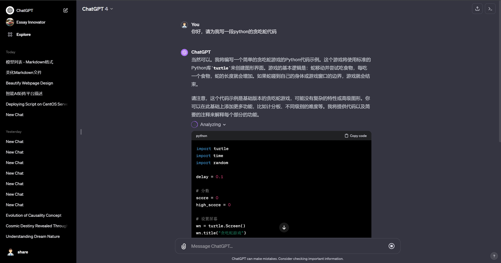
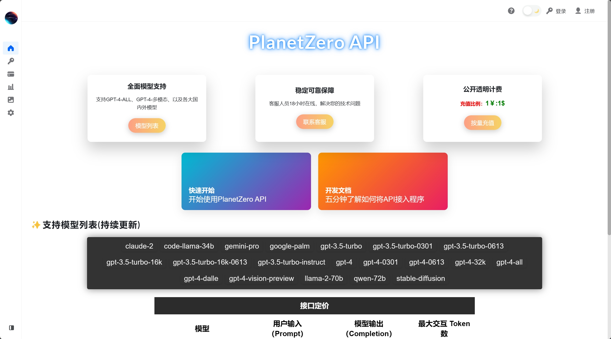
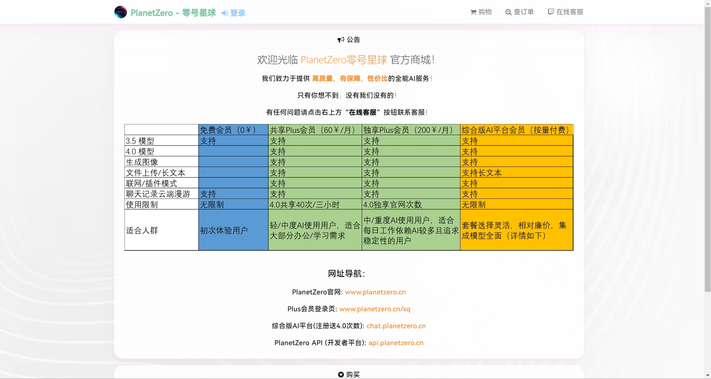

# 使用入口

<!-- <el-button type="success">成功按钮</el-button>
<kefu></kefu> -->

<el-row :gutter="10">
<navcard CardName="全能版" Url="https://chat.planetzero.cn">
简洁，高效的使用界面 
支持大部分AI模型  
灵活的高级计费方式   
</img>
</navcard>
<navcard CardName="官网版" Url="https://planetzero.cn/xq/">
官方1:1界面 & 功能，支持会话记录存储及漫游。 
丰富的插件扩展功能 
国内直连，无需魔法  
</img>
</navcard>
<navcard CardName="开发者平台" Url="https://api.planetzero.cn">
支持国内外各大模型API接入 
客服人员18小时在线，解决您的技术问题 
1元兑换1美刀，最具性价比的解决方案  
</img>
</navcard>
<navcard CardName="PlanetZero官方商城" Url="https://shop.planetzero.cn">
便捷购买PlanetZero全部产品 
超多活动折扣 
售后客服全程保障  
</img>
</navcard>
</el-row>

<!-- <ClientOnly>
<kefu></kefu>

</ClientOnly> -->
