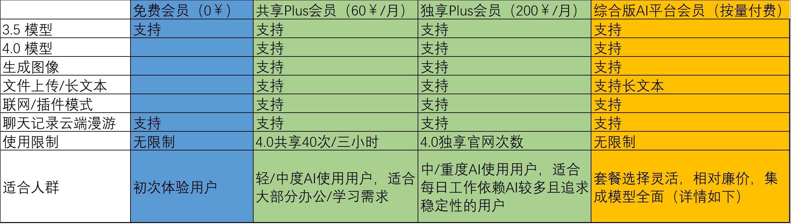
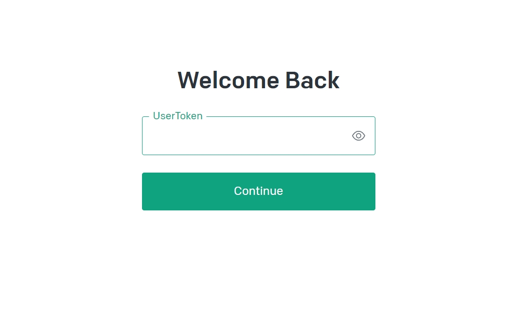
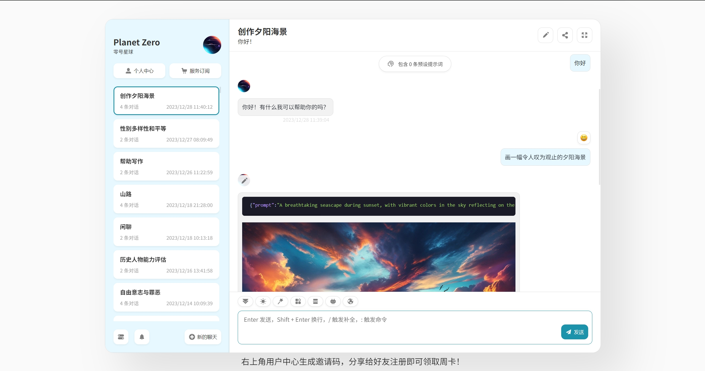

# 服务体系

::: 说明
会员服务非必须，免费会员可使用3.5以及有限4.0。付费会员可以获得更多功能（详情如下）以及更好的稳定性。

我们承诺绝不会因为会员而影响到普通用户的使用体验。
:::

## 功能对比

## Plus会员使用指南

咨询客服购买会员后,您将接收到会员专属`accessToken`,请妥善保管。`accessToken`是您的会员身份凭证,请勿泄露。[选择合适的星球](https://planetzero.cn/xq/)，输入`accessToken`后进行使用.

## 综合版会员使用指南

[使用地址](https://chat.planetzero.cn/)：chat.planetzero.cn
[详细使用指南](https://docs.qq.com/aio/DS1Jjc09GQVFDdEly)

### 基础模型：
- **gpt-3.5-turbo** - 响应最快的模型，适合处理日常事务
- **gpt-3.5-turbo-16k** - 在第一个模型的处理能力基础上将处理上下文的能力扩大到16k
- **gemini-pro** - 谷歌最新模型
- **llama-13b-chat-v2** - 很有意思的开源模型
- **智谱AI** - 中国 · 智谱AI(清华大学)
- **文心一言** - 国产大模型，百度最新一代产品

### 高级模型：
- **gpt-4** - 公认性能最强模型，逻辑理解能力很强
- **gpt-4全能版** - 在gpt-4的基础上内置了联网和画图的能力
- **gpt-4-32k** - 将gpt-4的上下文长度扩大到32k
- **claude-2** - Anthropic最强模型，上下文长度扩大到100k
  
### 绘画模型：
- **Midjourney** - 目前性能最强模型
- **Dalle-E** - OpenAI最新绘画模型，速度更快，理解能力更强
- **Stable-Diffusion** - 限制更少，速度极快，拓展性更强，偏写实

## 如何购买

Plus会员请扫码联系微信客服购买。综合版AI平台用户可在平台内直接购买。

